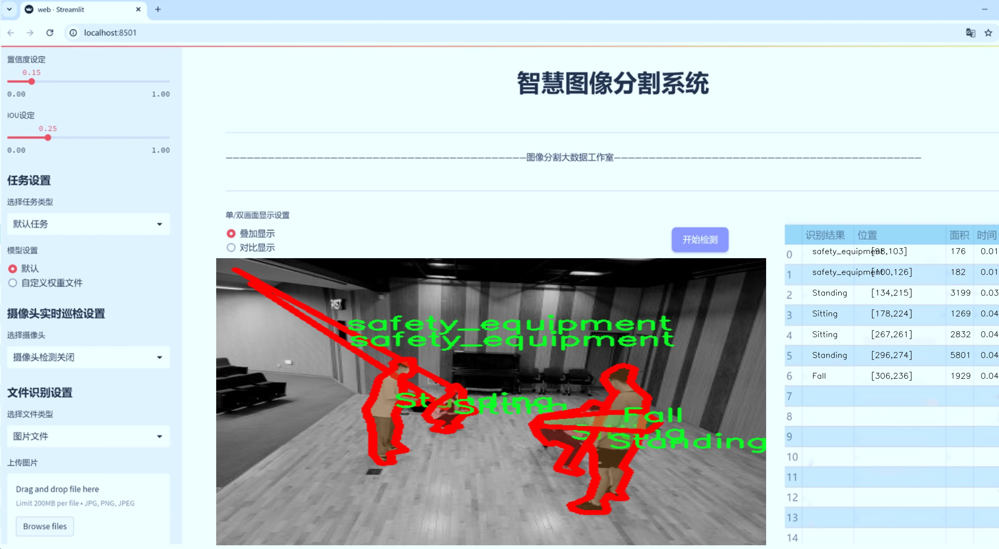
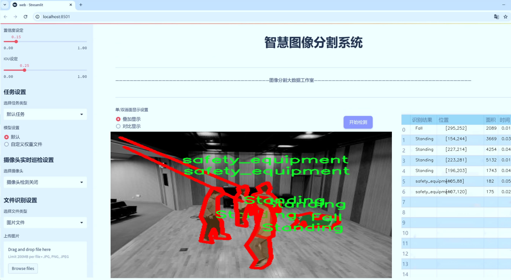
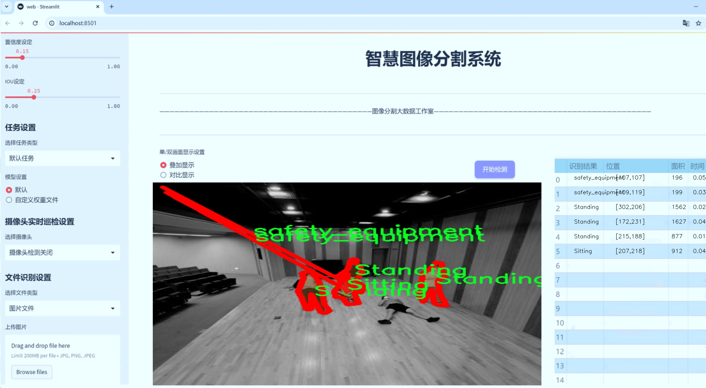
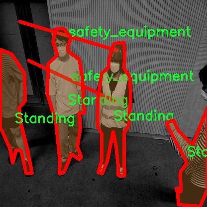
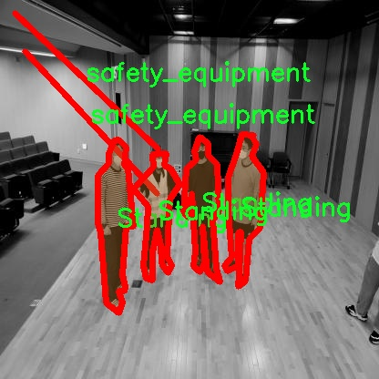
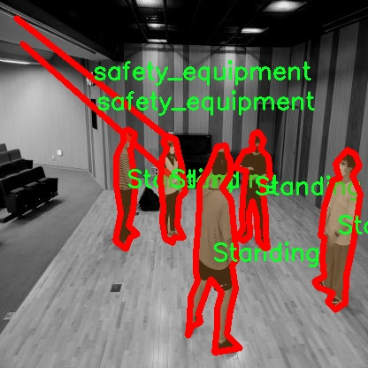
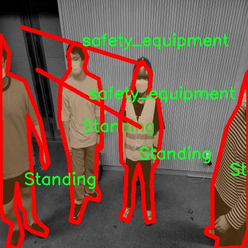
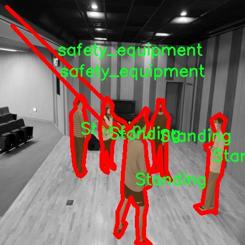

# 人类姿态分割系统： yolov8-seg-C2f-DySnakeConv

### 1.研究背景与意义

[参考博客](https://gitee.com/YOLOv8_YOLOv11_Segmentation_Studio/projects)

[博客来源](https://kdocs.cn/l/cszuIiCKVNis)

研究背景与意义

随着人工智能技术的迅猛发展，计算机视觉领域的研究不断深入，尤其是在人体姿态识别和分割方面的应用日益广泛。人体姿态分割不仅在安防监控、智能家居、虚拟现实等领域具有重要的应用价值，同时也为人机交互、运动分析和医疗康复等提供了新的研究方向。近年来，YOLO（You Only Look Once）系列模型因其高效的实时检测能力而受到广泛关注。YOLOv8作为该系列的最新版本，具备了更强的特征提取能力和更快的推理速度，成为实现高精度姿态分割的理想选择。

本研究旨在基于改进的YOLOv8模型，构建一个高效的人类姿态分割系统。我们使用的数据集“HumanPose”包含4600张图像，涵盖了四个主要类别：跌倒、坐着、站立和佩戴安全装备。这些类别不仅反映了人类在日常生活中的多样化姿态，也为系统的实用性提供了良好的基础。尤其是在安全监控领域，能够准确识别和分割跌倒姿态，对于及时救助和事故预防具有重要意义。此外，坐着和站立的姿态识别对于办公环境的健康监测、运动员的姿态分析等也有着广泛的应用前景。

在现有的研究中，尽管YOLO系列模型在目标检测上取得了显著成果，但在姿态分割任务中仍面临一些挑战。例如，复杂背景、姿态变化和遮挡等因素可能导致分割精度下降。因此，改进YOLOv8模型，增强其在姿态分割任务中的表现，具有重要的学术价值和实际意义。本研究将通过引入多尺度特征融合、注意力机制等技术，提升模型对不同姿态的识别能力，从而实现更高精度的分割效果。

此外，本研究还将探讨如何通过数据增强和迁移学习等方法，进一步提升模型的泛化能力。数据集中的多样化姿态类别为模型的训练提供了丰富的样本，然而，如何有效利用这些样本，提高模型在未见数据上的表现，仍然是一个亟待解决的问题。通过系统地分析不同姿态的特征及其在图像中的表现，我们希望能够提出一种更为高效的训练策略，以提高模型的适应性和鲁棒性。

综上所述，基于改进YOLOv8的人类姿态分割系统的研究，不仅具有重要的理论意义，也为实际应用提供了有力的支持。通过提升姿态分割的精度和效率，我们期待能够为智能监控、健康管理等领域提供更为精准的技术解决方案，推动相关技术的进一步发展。

### 2.图片演示







注意：本项目提供完整的训练源码数据集和训练教程,由于此博客编辑较早,暂不提供权重文件（best.pt）,需要按照6.训练教程进行训练后实现上图效果。

### 3.视频演示

[3.1 视频演示](https://www.bilibili.com/video/BV1HFUPYgEbG/)

### 4.数据集信息

##### 4.1 数据集类别数＆类别名

nc: 4
names: ['Fall', 'Sitting', 'Standing', 'safety_equipment']


##### 4.2 数据集信息简介

数据集信息展示

在当今快速发展的计算机视觉领域，人类姿态分割技术的研究愈发受到重视。为了提升YOLOv8-seg模型在这一领域的表现，我们采用了名为“HumanPose”的数据集。该数据集专注于人类姿态的识别与分割，包含了丰富的场景和多样的人体姿态，为模型的训练提供了坚实的基础。

“HumanPose”数据集的设计旨在涵盖四种主要的姿态类别，具体包括“Fall”（跌倒）、“Sitting”（坐着）、“Standing”（站立）和“safety_equipment”（佩戴安全装备）。这些类别不仅反映了日常生活中的常见姿态，还特别考虑了安全相关的场景，旨在提升模型在实际应用中的有效性和准确性。每个类别的样本数量均经过精心挑选，以确保模型在训练过程中能够接触到多样化的姿态变化和环境条件。

在数据集的构建过程中，研究团队通过精细的标注工作，确保每一帧图像中的人类姿态都得到了准确的标识。数据集中的图像来源于不同的场景，包括室内和室外环境，涵盖了不同的光照条件和背景复杂度。这种多样性不仅提高了模型的鲁棒性，也使得其在实际应用中能够更好地适应各种环境。

为了增强模型的泛化能力，数据集还引入了数据增强技术，如随机裁剪、旋转、颜色变换等。这些技术的应用使得训练过程中模型能够接触到更多的变异情况，从而提高其在未见数据上的表现。通过这些精心设计的策略，研究团队期望能够训练出一个在各种姿态识别任务中都能表现优异的YOLOv8-seg模型。

此外，数据集的使用不仅限于模型的训练阶段。在验证和测试阶段，研究人员同样依赖于“HumanPose”数据集中的标注信息，以评估模型的性能和准确性。通过对比模型在不同类别上的表现，研究团队能够深入分析模型的优缺点，从而为后续的改进提供数据支持。

总之，“HumanPose”数据集为改进YOLOv8-seg的人类姿态分割系统提供了一个丰富而多样的训练基础。通过对四种姿态类别的精确标注和多样化的样本选择，该数据集不仅提升了模型的训练效果，也为其在实际应用中的推广奠定了坚实的基础。随着技术的不断进步，未来的研究将进一步探索如何利用这一数据集，推动人类姿态识别技术的发展，进而在安全监控、智能家居、医疗辅助等领域发挥更大的作用。











### 5.项目依赖环境部署教程（零基础手把手教学）

[5.1 环境部署教程链接（零基础手把手教学）](https://www.bilibili.com/video/BV1jG4Ve4E9t/?vd_source=bc9aec86d164b67a7004b996143742dc)


[5.2 安装Python虚拟环境创建和依赖库安装视频教程链接（零基础手把手教学）](https://www.bilibili.com/video/BV1nA4VeYEze/?vd_source=bc9aec86d164b67a7004b996143742dc)

### 6.手把手YOLOV8-seg训练视频教程（零基础手把手教学）

[6.1 手把手YOLOV8-seg训练视频教程（零基础小白有手就能学会）](https://www.bilibili.com/video/BV1cA4VeYETe/?vd_source=bc9aec86d164b67a7004b996143742dc)


按照上面的训练视频教程链接加载项目提供的数据集，运行train.py即可开始训练



     Epoch   gpu_mem       box       obj       cls    labels  img_size
     1/200     0G   0.01576   0.01955  0.007536        22      1280: 100%|██████████| 849/849 [14:42<00:00,  1.04s/it]
               Class     Images     Labels          P          R     mAP@.5 mAP@.5:.95: 100%|██████████| 213/213 [01:14<00:00,  2.87it/s]
                 all       3395      17314      0.994      0.957      0.0957      0.0843

     Epoch   gpu_mem       box       obj       cls    labels  img_size
     2/200     0G   0.01578   0.01923  0.007006        22      1280: 100%|██████████| 849/849 [14:44<00:00,  1.04s/it]
               Class     Images     Labels          P          R     mAP@.5 mAP@.5:.95: 100%|██████████| 213/213 [01:12<00:00,  2.95it/s]
                 all       3395      17314      0.996      0.956      0.0957      0.0845

     Epoch   gpu_mem       box       obj       cls    labels  img_size
     3/200     0G   0.01561    0.0191  0.006895        27      1280: 100%|██████████| 849/849 [10:56<00:00,  1.29it/s]
               Class     Images     Labels          P          R     mAP@.5 mAP@.5:.95: 100%|███████   | 187/213 [00:52<00:00,  4.04it/s]
                 all       3395      17314      0.996      0.957      0.0957      0.0845


### 7.50+种全套YOLOV8-seg创新点加载调参实验视频教程（一键加载写好的改进模型的配置文件）

[7.1 50+种全套YOLOV8-seg创新点加载调参实验视频教程（一键加载写好的改进模型的配置文件）](https://www.bilibili.com/video/BV1Hw4VePEXv/?vd_source=bc9aec86d164b67a7004b996143742dc)

### YOLOV8-seg算法简介

原始YOLOv8-seg算法原理

YOLOv8-seg算法是YOLO系列中的一个重要进展，结合了目标检测和图像分割的能力，旨在实现更高效的图像理解。与其前身YOLOv5相比，YOLOv8-seg在多个方面进行了显著改进，尤其是在处理复杂背景和小目标方面。该算法的设计理念源于对传统anchor-based检测方法的反思，YOLOv8采用了anchor-free的策略，这使得它在检测精度和速度上都有了显著提升。

YOLOv8-seg的网络结构主要由四个模块组成：输入端、主干网络、Neck端和输出端。输入端负责对输入图像进行预处理，包括Mosaic数据增强、自适应图片缩放和灰度填充等技术，以增强模型的鲁棒性和适应性。主干网络采用了C2f模块，取代了YOLOv5中的C3模块，C2f模块通过引入更多的分支来丰富梯度流动，从而提高特征提取的效率和效果。SPPF模块则在特征图的处理上，通过不同内核尺寸的池化操作，进一步增强了特征图的表达能力。

在Neck端，YOLOv8-seg继续采用FPN（特征金字塔网络）和PAN（路径聚合网络）的结合，以实现多尺度特征的有效融合。这一结构不仅提升了网络对不同尺度目标的检测能力，还增强了语义信息与定位信息之间的交互。通过上采样和下采样的结合，Neck端能够更好地整合来自主干网络的多层次特征，为后续的检测任务提供更为丰富的信息。

输出端则采用了解耦头（Decoupled Head）结构，这一设计使得分类和回归任务可以并行进行，从而加速了模型的收敛过程。解耦头的引入使得YOLOv8-seg在处理复杂场景时，能够更好地分离目标的类别信息和位置信息，提高了检测的准确性。

在标签分配策略上，YOLOv8-seg采用了动态标签分配策略，这一策略旨在解决传统方法中正负样本匹配不均衡的问题。通过引入Varifocal Loss，YOLOv8-seg能够更有效地处理正负样本的损失计算，使得模型在训练过程中更加关注高质量的正样本，从而提升整体的检测性能。

尽管YOLOv8-seg在多个方面进行了优化，但在复杂水面环境下，尤其是对于小目标的检测，仍然面临着一定的挑战。为了解决这些问题，YOLOv8-seg引入了BiFormer双层路由注意力机制，构建了C2fBF模块，以减轻主干网络下采样过程中的噪声影响。这一机制通过捕获远程依赖，保留了特征提取过程中更细粒度的上下文信息，从而提升了模型对小目标的感知能力。

此外，YOLOv8-seg还在Neck端引入了GSConv和Slim-neck技术，以保持检测精度的同时降低计算量。这些技术的结合使得YOLOv8-seg在保证高效性的同时，能够更好地应对复杂背景和小目标的挑战。最后，YOLOv8-seg使用MPDIoU损失函数替代了传统的CIoU损失函数，进一步提高了模型的泛化能力和精准度。

综上所述，YOLOv8-seg算法通过对网络结构的优化、标签分配策略的改进以及损失函数的替换，成功地提升了目标检测和图像分割的性能。尽管在复杂环境下仍存在一些不足，但YOLOv8-seg的设计理念和技术实现为未来的研究提供了重要的参考，尤其是在小目标检测和复杂背景处理方面。随着技术的不断进步，YOLOv8-seg有望在更广泛的应用场景中发挥其优势，推动计算机视觉领域的发展。


### 9.系统功能展示（检测对象为举例，实际内容以本项目数据集为准）

图9.1.系统支持检测结果表格显示

  图9.2.系统支持置信度和IOU阈值手动调节

  图9.3.系统支持自定义加载权重文件best.pt(需要你通过步骤5中训练获得)

  图9.4.系统支持摄像头实时识别

  图9.5.系统支持图片识别

  图9.6.系统支持视频识别

  图9.7.系统支持识别结果文件自动保存

  图9.8.系统支持Excel导出检测结果数据


### 10.50+种全套YOLOV8-seg创新点原理讲解（非科班也可以轻松写刊发刊，V11版本正在科研待更新）

#### 10.1 由于篇幅限制，每个创新点的具体原理讲解就不一一展开，具体见下列网址中的创新点对应子项目的技术原理博客网址【Blog】：


[10.1 50+种全套YOLOV8-seg创新点原理讲解链接](https://gitee.com/qunmasj/good)

#### 10.2 部分改进模块原理讲解(完整的改进原理见上图和技术博客链接)【如果此小节的图加载失败可以通过CSDN或者Github搜索该博客的标题访问原始博客，原始博客图片显示正常】
### 深度学习基础
卷积神经网络通过使用具有共享参数的卷积运算显著降低了模型的计算开销和复杂性。在LeNet、AlexNet和VGG等经典网络的驱动下，卷积神经网络现在已经建立了一个完整的系统，并在深度学习领域形成了先进的卷积神经网络模型。

感受野注意力卷积RFCBAMConv的作者在仔细研究了卷积运算之后获得了灵感。对于分类、目标检测和语义分割任务，一方面，图像中不同位置的对象的形状、大小、颜色和分布是可变的。在卷积操作期间，卷积核在每个感受野中使用相同的参数来提取信息，而不考虑来自不同位置的差分信息。这限制了网络的性能，这已经在最近的许多工作中得到了证实。

另一方面，卷积运算没有考虑每个特征的重要性，这进一步影响了提取特征的有效性，并最终限制了模型的性能。此外，注意力机制允许模型专注于重要特征，这可以增强特征提取的优势和卷积神经网络捕获详细特征信息的能力。因此，注意力机制在深度学习中得到了广泛的应用，并成功地应用于各个领域。

通过研究卷积运算的内在缺陷和注意力机制的特点，作者认为现有的空间注意力机制从本质上解决了卷积运算的参数共享问题，但仍局限于对空间特征的认知。对于较大的卷积核，现有的空间注意力机制并没有完全解决共享参数的问题。此外，他们无法强调感受野中每个特征的重要性，例如现有的卷积块注意力模块（CBAM）和 Coordinate注意力（CA）。

因此，[参考该博客提出了一种新的感受野注意力机制（RFA）](https://qunmasj.com)，它完全解决了卷积核共享参数的问题，并充分考虑了感受野中每个特征的重要性。通过RFA设计的卷积运算（RFAConv）是一种新的卷积运算，可以取代现有神经网络中的标准卷积运算。RFAConv通过添加一些参数和计算开销来提高网络性能。

大量关于Imagnet-1k、MS COCO和VOC的实验已经证明了RFAConv的有效性。作为一种由注意力构建的新型卷积运算，它超过了由CAM、CBAM和CA构建的卷积运算（CAMConv、CBAMConv、CAConv）以及标准卷积运算。

此外，为了解决现有方法提取感受野特征速度慢的问题，提出了一种轻量级操作。在构建RFAConv的过程中，再次设计了CA和CBAM的升级版本，并进行了相关实验。作者认为当前的空间注意力机制应该将注意力放在感受野空间特征上，以促进当前空间注意力机制的发展，并再次增强卷积神经网络架构的优势。


### 卷积神经网络架构
出色的神经网络架构可以提高不同任务的性能。卷积运算作为卷积神经网络的一种基本运算，推动了人工智能的发展，并为车辆检测、无人机图像、医学等先进的网络模型做出了贡献。He等人认为随着网络深度的增加，该模型将变得难以训练并产生退化现象，因此他们提出了残差连接来创新卷积神经网络架构的设计。Huang等人通过重用特征来解决网络梯度消失问题，增强了特征信息，他们再次创新了卷积神经网络架构。

通过对卷积运算的详细研究，Dai等人认为，具有固定采样位置的卷积运算在一定程度上限制了网络的性能，因此提出了Deformable Conv，通过学习偏移来改变卷积核的采样位置。在Deformable Conv的基础上，再次提出了Deformable Conv V2和Deformable Conv V3，以提高卷积网络的性能。

Zhang等人注意到，组卷积可以减少模型的参数数量和计算开销。然而，少于组内信息的交互将影响最终的网络性能。1×1的卷积可以与信息相互作用。然而，这将带来更多的参数和计算开销，因此他们提出了无参数的“通道Shuffle”操作来与组之间的信息交互。

Ma等人通过实验得出结论，对于参数较少的模型，推理速度不一定更快，对于计算量较小的模型，推理也不一定更快。经过仔细研究提出了Shufflenet V2。

YOLO将输入图像划分为网格，以预测对象的位置和类别。经过不断的研究，已经提出了8个版本的基于YOLO的目标检测器，如YOLOv5、YOLOv7、YOLOv8等。上述卷积神经网络架构已经取得了巨大的成功。然而，它们并没有解决提取特征过程中的参数共享问题。本文的工作从注意力机制开始，从一个新的角度解决卷积参数共享问题。

### 注意力机制
注意力机制被用作一种提高网络模型性能的技术，使其能够专注于关键特性。注意力机制理论已经在深度学习中建立了一个完整而成熟的体系。Hu等人提出了一种Squeeze-and-Excitation（SE）块，通过压缩特征来聚合全局通道信息，从而获得与每个通道对应的权重。Wang等人认为，当SE与信息交互时，单个通道和权重之间的对应关系是间接的，因此设计了高效通道注Efficient Channel Attention力（ECA），并用自适应kernel大小的一维卷积取代了SE中的全连接（FC）层。Woo等人提出了卷积块注意力模块（CBAM），它结合了通道注意力和空间注意力。作为一个即插即用模块，它可以嵌入卷积神经网络中，以提高网络性能。

尽管SE和CBAM已经提高了网络的性能。Hou等人仍然发现压缩特征在SE和CBAM中丢失了太多信息。因此，他们提出了轻量级Coordinate注意力（CA）来解决SE和CBAM中的问题。Fu等人计了一个空间注意力模块和通道注意力模块，用于扩展全卷积网络（FCN），分别对空间维度和通道维度的语义相关性进行建模。Zhang等人在通道上生成不同尺度的特征图，以建立更有效的通道注意力机制。

本文从一个新的角度解决了标准卷积运算的参数共享问题。这就是将注意力机制结合起来构造卷积运算。尽管目前的注意力机制已经获得了良好的性能，但它们仍然没有关注感受野的空间特征。因此，设计了具有非共享参数的RFA卷积运算，以提高网络的性能。


#### 回顾标准卷积
以标准卷积运算为基础构建卷积神经网络，通过共享参数的滑动窗口提取特征信息，解决了全连接层构建的神经网络的固有问题（即参数数量大、计算开销高）。

设表示输入特征图，其中、和分别表示特征图的通道数、高度和宽度。为了能够清楚地展示卷积核提取特征信息的过程，以为例。提取每个感受野slider的特征信息的卷积运算可以表示如下：


这里，表示在每次卷积slider操作之后获得的值，表示在每个slider内的相应位置处的像素值。表示卷积核，表示卷积核中的参数数量，表示感受野slider的总数。

可以看出，每个slider内相同位置的特征共享相同的参数。因此，标准的卷积运算无法感知不同位置带来的差异信息，这在一定程度上限制了卷积神经网络的性能。

#### 回顾空间注意力
目前，空间注意力机制使用通过学习获得的注意力图来突出每个特征的重要性。与上一节类似，以为例。突出关键特征的空间注意力机制可以简单地表达如下：


这里，表示在加权运算之后获得的值。和分别表示输入特征图和学习注意力图在不同位置的值，是输入特征图的高度和宽度的乘积，表示像素值的总数。一般来说，整个过程可以简单地表示在图1中。


#### 空间注意力与标准卷积
众所周知，将注意力机制引入卷积神经网络可以提高网络的性能。通过标准的卷积运算和对现有空间注意力机制的仔细分析。作者认为空间注意力机制本质上解决了卷积神经网络的固有缺点，即共享参数的问题。

目前，该模型最常见的卷积核大小为1×1和3×3。引入空间注意力机制后用于提取特征的卷积操作是1×1或3×3卷积操作。这个过程可以直观地显示出来。空间注意力机制被插入到1×1卷积运算的前面。通过注意力图对输入特征图进行加权运算（Re-weight“×”），最后通过1×1卷积运算提取感受野的slider特征信息。

整个过程可以简单地表示如下：


 

这里，卷积核仅表示一个参数值。如果将的值作为一个新的卷积核参数，那么有趣的是，通过1×1卷积运算提取特征时的参数共享问题得到了解决。然而，空间注意力机制的传说到此结束。当空间注意力机制被插入到3×3卷积运算的前面时。具体情况如下：


如上所述，如果取的值。作为一种新的卷积核参数，上述方程完全解决了大规模卷积核的参数共享问题。然而，最重要的一点是，卷积核在每个感受野slider中提取将共享部分特征的特征。换句话说，在每个感受野slider内都会有重叠。

经过仔细分析发现，，…，空间注意力图的权重在每个slider内共享。因此，空间注意机制不能解决大规模卷积核共享参数的问题，因为它们不注意感受野的空间特征。在这种情况下，空间注意力机制是有限的。
#### 创新空间注意力与标准卷积
RFA是为了解决空间注意力机制问题而提出的，创新了空间注意力。使用与RFA相同的思想，一系列空间注意力机制可以再次提高性能。RFA设计的卷积运算可以被视为一种轻量级的即插即用模块，以取代标准卷积，从而提高卷积神经网络的性能。因此，作者认为空间注意力机制和标准卷积在未来将有一个新的春天。

感受野的空间特征：

现在给出感受野空间特征的定义。它是专门为卷积核设计的，并根据kernel大小动态生成，如图2所示，以3×3卷积核为例。


在图2中，“空间特征”表示原始特征图，等于空间特征。“感受野空间特征”表示变换后的特征，该特征由每个感受野slider滑块组成，并且不重叠。也就是说，“感受野空间特征”中的每个3×3大小的slider表示提取原始3×3卷积特征时所有感觉野slider的特征。

#### 感受野注意力卷积(RFA):

关于感受野空间特征，该博客的作者提出了感受野注意（RFA），它不仅强调了感受野slider内各种特征的重要性，而且还关注感受野空间特性，以彻底解决卷积核参数共享的问题。感受野空间特征是根据卷积核的大小动态生成的，因此，RFA是卷积的固定组合，不能脱离卷积运算的帮助，卷积运算同时依赖RFA来提高性能。

因此，作者提出了感受野注意力卷积（RFAConv）。具有3×3大小卷积核的RFAConv的总体结构如图3所示。


目前，提取感受野特征最常用的方法速度较慢，因此经过不断探索提出了一种快速的方法，通过分组卷积来取代原来的方法。

具体来说，根据感受野大小，使用相应的组卷积大小来动态生成展开特征。尽管与原始的无参数方法（如Pytorch提供的nn.Unfld()）相比，该方法添加了一些参数，但速度要快得多。

注意：正如在上一节中提到的，当原始的3×3卷积核提取特征时，感受野空间特征中的每个3×3大小的窗口表示所有感受野滑块的特征。但在快速分组卷积提取感受野特征后，由于原始方法太慢，它们会被映射到新的特征中。

最近的一些工作已经证明信息交互可以提高网络性能。类似地，对于RFAConv，与感受野特征信息交互以学习注意力图可以提高网络性能，但与每个感受野特征交互将带来额外的计算开销。为了确保少量的计算开销和参数数量，通过探索使用AvgPool池化每个感受野特征的全局信息，然后通过1×1组卷积运算与信息交互。最后，softmax用于强调感受野特征中每个特征的重要性。通常，RFA的计算可以表示为：


表示分组卷积，表示卷积核的大小，代表规范化，表示输入特征图，是通过将注意力图与变换的感受野空间特征相乘而获得的。

与CBAM和CA不同，RFA可以为每个感受野特征生成注意力图。标准卷积受到卷积神经网络性能的限制，因为共享参数的卷积运算对位置带来的差异信息不敏感。RFA完全可以解决这个问题，具体细节如下：


由于RFA获得的特征图是“调整形状”后不重叠的感受野空间特征，因此通过池化每个感受野滑块的特征信息来学习学习的注意力图。换句话说，RFA学习的注意力图不再在每个感受野slider内共享，并且是有效的。这完全解决了现有的CA和CBAM对大尺寸kernel的注意力机制中的参数共享问题。

同时，RFA给标准卷积核带来了相当大的好处，但调整形状后，特征的高度和宽度是k倍，需要进行k×k的stride卷积运算，才能提取特征信息。RFAConv创新了标准卷积运算。

此外，空间注意力机制将得到升级，因为作者认为现有的空间注意力机制应该专注于感受野空间特征，以提高网络的性能。众所周知，基于自注意力机制的网络模型取得了巨大的成功，因为它解决了卷积参数共享的问题，并对远程信息进行了建模，但基于自注意力机理的方法给模型带来了巨大的计算开销和复杂性。作者认为通过将一些现有空间注意力机制的注意力放在感受野空间特征中，它以轻量级的方式解决了自注意力机制的问题。

答案如下：

将关注感受野空间特征的空间注意力与卷积相匹配，完全解决了卷积参数共享的问题；

当前的空间注意力机制本身具有考虑远距离信息的特点，它们通过全局平均池化或全局最大池化来获得全局信息，这在一定程度上考虑了远距离信息。


为此，作者设计了一种新的CBAM和CA，称为RFACBAM和RFACA，它专注于感受野的空间特征。与RFA类似，使用stride为k的k×k的最终卷积运算来提取特征信息，具体结构如图4和图5所示，将这2种新的卷积方法称为RFCBAMConv和RFCAConv。比较原始的CBAM，使用SE注意力来代替RFCBAM中的CAM。因为这样可以减少计算开销。


此外，在RFCBAM中，通道和空间注意力不是在单独的步骤中执行的，因为通道和空间注意力是同时加权的，从而允许在每个通道上获得的注意力图是不同的。


### 11.项目核心源码讲解（再也不用担心看不懂代码逻辑）

#### 11.1 ultralytics\models\yolo\pose\train.py

以下是对代码中最核心部分的提取和详细中文注释：

```python
# 导入必要的库和模块
from copy import copy
from ultralytics.models import yolo
from ultralytics.nn.tasks import PoseModel
from ultralytics.utils import DEFAULT_CFG, LOGGER
from ultralytics.utils.plotting import plot_images, plot_results

class PoseTrainer(yolo.detect.DetectionTrainer):
    """
    PoseTrainer类扩展了DetectionTrainer类，用于基于姿态模型的训练。

    示例:
        ```python
        from ultralytics.models.yolo.pose import PoseTrainer

        args = dict(model='yolov8n-pose.pt', data='coco8-pose.yaml', epochs=3)
        trainer = PoseTrainer(overrides=args)
        trainer.train()
        ```
    """

    def __init__(self, cfg=DEFAULT_CFG, overrides=None, _callbacks=None):
        """初始化PoseTrainer对象，使用指定的配置和覆盖参数。"""
        if overrides is None:
            overrides = {}
        overrides['task'] = 'pose'  # 设置任务类型为姿态估计
        super().__init__(cfg, overrides, _callbacks)  # 调用父类构造函数

        # 针对Apple MPS设备的警告
        if isinstance(self.args.device, str) and self.args.device.lower() == 'mps':
            LOGGER.warning("WARNING ⚠️ Apple MPS known Pose bug. Recommend 'device=cpu' for Pose models. "
                           'See https://github.com/ultralytics/ultralytics/issues/4031.')

    def get_model(self, cfg=None, weights=None, verbose=True):
        """获取指定配置和权重的姿态估计模型。"""
        model = PoseModel(cfg, ch=3, nc=self.data['nc'], data_kpt_shape=self.data['kpt_shape'], verbose=verbose)
        if weights:
            model.load(weights)  # 加载模型权重

        return model  # 返回模型实例

    def set_model_attributes(self):
        """设置PoseModel的关键点形状属性。"""
        super().set_model_attributes()  # 调用父类方法
        self.model.kpt_shape = self.data['kpt_shape']  # 设置关键点形状

    def get_validator(self):
        """返回PoseValidator类的实例，用于验证。"""
        self.loss_names = 'box_loss', 'pose_loss', 'kobj_loss', 'cls_loss', 'dfl_loss'  # 定义损失名称
        return yolo.pose.PoseValidator(self.test_loader, save_dir=self.save_dir, args=copy(self.args))  # 返回验证器实例

    def plot_training_samples(self, batch, ni):
        """绘制一批训练样本，包括标注的类别标签、边界框和关键点。"""
        images = batch['img']  # 获取图像
        kpts = batch['keypoints']  # 获取关键点
        cls = batch['cls'].squeeze(-1)  # 获取类别
        bboxes = batch['bboxes']  # 获取边界框
        paths = batch['im_file']  # 获取图像文件路径
        batch_idx = batch['batch_idx']  # 获取批次索引
        plot_images(images,
                    batch_idx,
                    cls,
                    bboxes,
                    kpts=kpts,
                    paths=paths,
                    fname=self.save_dir / f'train_batch{ni}.jpg',  # 保存绘制的图像
                    on_plot=self.on_plot)  # 绘制图像

    def plot_metrics(self):
        """绘制训练/验证指标。"""
        plot_results(file=self.csv, pose=True, on_plot=self.on_plot)  # 保存结果图像
```

### 代码核心部分分析：
1. **PoseTrainer类**：这是一个用于姿态估计训练的类，继承自YOLO的DetectionTrainer类。
2. **初始化方法**：设置任务类型为姿态估计，并处理特定设备（如Apple MPS）的警告。
3. **获取模型**：根据配置和权重加载姿态估计模型。
4. **设置模型属性**：设置模型的关键点形状属性。
5. **获取验证器**：返回用于验证的PoseValidator实例，并定义损失名称。
6. **绘制训练样本**：将训练样本的图像、关键点、类别和边界框绘制并保存。
7. **绘制指标**：绘制训练和验证过程中的指标，便于分析模型性能。

以上是对代码的核心部分及其功能的详细注释。

该文件 `train.py` 是一个用于训练姿态估计模型的脚本，属于 Ultralytics YOLO 项目的一部分。文件中定义了一个名为 `PoseTrainer` 的类，该类继承自 `DetectionTrainer`，专门用于处理与姿态估计相关的训练任务。

在类的初始化方法 `__init__` 中，首先调用父类的构造函数，并传入配置参数和覆盖参数。如果没有提供覆盖参数，则初始化为空字典。接着，将任务类型设置为 `'pose'`。如果设备类型为 `'mps'`（即 Apple 的 Metal Performance Shaders），则会发出警告，建议使用 CPU 进行姿态模型的训练，以避免已知的 bug。

`get_model` 方法用于获取姿态估计模型。它接受配置和权重参数，并创建一个 `PoseModel` 实例。模型的通道数（`ch`）设为 3，类别数（`nc`）和关键点形状（`data_kpt_shape`）则从数据集中提取。如果提供了权重参数，则会加载这些权重。

`set_model_attributes` 方法用于设置模型的关键点形状属性，确保模型能够正确处理输入数据的关键点信息。

`get_validator` 方法返回一个 `PoseValidator` 实例，用于模型验证。它会设置损失名称，包括边界框损失、姿态损失、关键对象损失、类别损失和 DFL 损失，以便在训练过程中进行监控。

`plot_training_samples` 方法用于可视化一批训练样本。它接收一个批次的数据，包括图像、关键点、类别、边界框和文件路径，并调用 `plot_images` 函数将这些信息绘制出来，生成带有标注的图像，便于观察训练效果。

最后，`plot_metrics` 方法用于绘制训练和验证过程中的指标，调用 `plot_results` 函数生成相应的图表，以便于分析模型的性能。

总体而言，该文件提供了一个结构化的方式来训练姿态估计模型，涵盖了模型的初始化、训练过程中的数据可视化以及性能监控等多个方面。

#### 11.2 ultralytics\data\loaders.py

以下是代码中最核心的部分，并附上详细的中文注释：

```python
class LoadStreams:
    """
    视频流加载器，用于处理各种类型的视频流。

    支持 RTSP、RTMP、HTTP 和 TCP 流，适用于 `yolo predict source='rtsp://example.com/media.mp4'`。

    属性：
        sources (str): 视频流的输入路径或 URL。
        imgsz (int): 处理的图像大小，默认为 640。
        vid_stride (int): 视频帧率步幅，默认为 1。
        buffer (bool): 是否缓冲输入流，默认为 False。
        running (bool): 指示流线程是否正在运行的标志。
        mode (str): 设置为 'stream'，表示实时捕获。
        imgs (list): 每个流的图像帧列表。
        fps (list): 每个流的帧率列表。
        frames (list): 每个流的总帧数列表。
        threads (list): 每个流的线程列表。
        shape (list): 每个流的形状列表。
        caps (list): 每个流的 cv2.VideoCapture 对象列表。
        bs (int): 处理的批量大小。

    方法：
        __init__: 初始化流加载器。
        update: 在守护线程中读取流帧。
        close: 关闭流加载器并释放资源。
        __iter__: 返回类的迭代器对象。
        __next__: 返回源路径、转换后的图像和原始图像以供处理。
        __len__: 返回源对象的长度。
    """

    def __init__(self, sources='file.streams', imgsz=640, vid_stride=1, buffer=False):
        """初始化实例变量并检查输入流形状的一致性。"""
        torch.backends.cudnn.benchmark = True  # 对于固定大小的推理更快
        self.buffer = buffer  # 缓冲输入流
        self.running = True  # 线程运行标志
        self.mode = 'stream'
        self.imgsz = imgsz
        self.vid_stride = vid_stride  # 视频帧率步幅
        sources = Path(sources).read_text().rsplit() if os.path.isfile(sources) else [sources]
        n = len(sources)
        self.sources = [ops.clean_str(x) for x in sources]  # 清理源名称以备后用
        self.imgs, self.fps, self.frames, self.threads, self.shape = [[]] * n, [0] * n, [0] * n, [None] * n, [[]] * n
        self.caps = [None] * n  # 视频捕获对象
        for i, s in enumerate(sources):  # 遍历源
            # 启动线程从视频流读取帧
            st = f'{i + 1}/{n}: {s}... '
            if urlparse(s).hostname in ('www.youtube.com', 'youtube.com', 'youtu.be'):  # 如果源是 YouTube 视频
                s = get_best_youtube_url(s)  # 获取最佳 YouTube 视频 URL
            s = eval(s) if s.isnumeric() else s  # 处理本地摄像头
            if s == 0 and (is_colab() or is_kaggle()):
                raise NotImplementedError("'source=0' webcam not supported in Colab and Kaggle notebooks. "
                                          "Try running 'source=0' in a local environment.")
            self.caps[i] = cv2.VideoCapture(s)  # 存储视频捕获对象
            if not self.caps[i].isOpened():
                raise ConnectionError(f'{st}Failed to open {s}')
            w = int(self.caps[i].get(cv2.CAP_PROP_FRAME_WIDTH))  # 获取视频宽度
            h = int(self.caps[i].get(cv2.CAP_PROP_FRAME_HEIGHT))  # 获取视频高度
            fps = self.caps[i].get(cv2.CAP_PROP_FPS)  # 获取视频帧率
            self.frames[i] = max(int(self.caps[i].get(cv2.CAP_PROP_FRAME_COUNT)), 0) or float('inf')  # 获取总帧数
            self.fps[i] = max((fps if math.isfinite(fps) else 0) % 100, 0) or 30  # 帧率回退为 30

            success, im = self.caps[i].read()  # 确保读取第一帧
            if not success or im is None:
                raise ConnectionError(f'{st}Failed to read images from {s}')
            self.imgs[i].append(im)  # 添加第一帧到图像列表
            self.shape[i] = im.shape  # 存储图像形状
            self.threads[i] = Thread(target=self.update, args=([i, self.caps[i], s]), daemon=True)  # 启动更新线程
            LOGGER.info(f'{st}Success ✅ ({self.frames[i]} frames of shape {w}x{h} at {self.fps[i]:.2f} FPS)')
            self.threads[i].start()  # 启动线程
        LOGGER.info('')  # 换行

        # 检查常见形状
        self.bs = self.__len__()  # 批量大小

    def update(self, i, cap, stream):
        """在守护线程中读取流 `i` 的帧。"""
        n, f = 0, self.frames[i]  # 帧数，帧数组
        while self.running and cap.isOpened() and n < (f - 1):
            if len(self.imgs[i]) < 30:  # 保持 <=30 帧的缓冲
                n += 1
                cap.grab()  # 抓取下一帧
                if n % self.vid_stride == 0:  # 根据步幅读取帧
                    success, im = cap.retrieve()  # 获取帧
                    if not success:
                        im = np.zeros(self.shape[i], dtype=np.uint8)  # 创建空图像
                        LOGGER.warning('WARNING ⚠️ Video stream unresponsive, please check your IP camera connection.')
                        cap.open(stream)  # 如果信号丢失，重新打开流
                    if self.buffer:
                        self.imgs[i].append(im)  # 如果缓冲，则添加图像
                    else:
                        self.imgs[i] = [im]  # 否则只保留当前图像
            else:
                time.sleep(0.01)  # 等待直到缓冲区为空

    def close(self):
        """关闭流加载器并释放资源。"""
        self.running = False  # 停止线程标志
        for thread in self.threads:
            if thread.is_alive():
                thread.join(timeout=5)  # 添加超时
        for cap in self.caps:  # 遍历存储的 VideoCapture 对象
            try:
                cap.release()  # 释放视频捕获
            except Exception as e:
                LOGGER.warning(f'WARNING ⚠️ Could not release VideoCapture object: {e}')
        cv2.destroyAllWindows()  # 关闭所有 OpenCV 窗口

    def __iter__(self):
        """迭代 YOLO 图像流并重新打开无响应的流。"""
        self.count = -1
        return self

    def __next__(self):
        """返回源路径、转换后的图像和原始图像以供处理。"""
        self.count += 1

        images = []
        for i, x in enumerate(self.imgs):
            # 等待每个缓冲区中有帧可用
            while not x:
                if not self.threads[i].is_alive() or cv2.waitKey(1) == ord('q'):  # 按 'q' 退出
                    self.close()
                    raise StopIteration
                time.sleep(1 / min(self.fps))  # 等待
                x = self.imgs[i]
                if not x:
                    LOGGER.warning(f'WARNING ⚠️ Waiting for stream {i}')

            # 从 imgs 缓冲区获取并移除第一帧
            if self.buffer:
                images.append(x.pop(0))  # 如果缓冲，移除并返回第一帧
            else:
                images.append(x.pop(-1) if x else np.zeros(self.shape[i], dtype=np.uint8))  # 否则返回最后一帧
                x.clear()  # 清空缓冲区

        return self.sources, images, None, ''  # 返回源、图像、None 和空字符串

    def __len__(self):
        """返回源对象的长度。"""
        return len(self.sources)  # 返回源的数量
```

以上代码是 YOLO 流加载器的核心部分，主要负责从视频流中读取帧并进行处理。通过详细的注释，便于理解每个方法和属性的功能及其作用。

这个程序文件是Ultralytics YOLO（You Only Look Once）框架的一部分，主要用于加载和处理不同类型的数据源，包括视频流、图像、屏幕截图等，以便进行目标检测等任务。文件中定义了多个类，每个类负责处理特定类型的数据源。

首先，`SourceTypes`类用于表示不同的输入源类型，包含四个布尔属性，分别指示是否为网络摄像头、截图、图像文件或张量数据。

接下来是`LoadStreams`类，它负责加载视频流，支持RTSP、RTMP、HTTP和TCP等协议。该类的构造函数初始化了一些重要的参数，如输入源、图像大小、视频帧率步幅等，并创建了多个线程来读取视频流中的帧。它使用OpenCV的`VideoCapture`对象来捕获视频流，并在后台线程中不断更新帧数据。该类还实现了迭代器接口，使得可以逐帧获取视频流中的图像。

`LoadScreenshots`类用于从屏幕捕获图像，适用于实时截图。它使用`mss`库来进行屏幕捕获，并允许用户指定捕获区域的坐标和大小。

`LoadImages`类则用于加载图像和视频文件，支持多种格式。它能够从给定的路径中读取文件，并根据文件类型进行分类，区分图像和视频。该类同样实现了迭代器接口，可以逐个返回图像或视频帧。

`LoadPilAndNumpy`类用于处理来自PIL和Numpy数组的图像数据，确保图像格式正确并进行必要的转换。它支持批量处理，并提供了简单的迭代功能。

`LoadTensor`类则专注于从PyTorch张量中加载图像数据，确保输入张量的格式和数值范围符合要求。

文件中还定义了`autocast_list`函数，用于将不同类型的输入源合并为Numpy数组或PIL图像的列表。此外，`get_best_youtube_url`函数用于从YouTube视频中提取最佳质量的MP4视频流URL，支持使用`pafy`或`yt_dlp`库。

最后，`LOADERS`元组将所有加载器类组合在一起，方便在其他地方使用。整体来看，这个文件为YOLO模型提供了灵活的数据加载和预处理功能，使得用户可以方便地使用不同来源的数据进行目标检测任务。

#### 11.3 ultralytics\solutions\ai_gym.py

以下是经过简化并添加详细中文注释的核心代码部分：

```python
import cv2
from ultralytics.utils.plotting import Annotator

class AIGym:
    """用于实时视频流中根据人体姿势管理健身动作的类。"""

    def __init__(self):
        """初始化AIGym，设置默认的视觉和图像参数。"""
        self.im0 = None  # 当前帧图像
        self.tf = None   # 线条厚度
        self.keypoints = None  # 关键点数据
        self.poseup_angle = None  # 上举姿势的角度阈值
        self.posedown_angle = None  # 下放姿势的角度阈值
        self.threshold = 0.001  # 阈值
        self.angle = None  # 当前角度
        self.count = None  # 动作计数
        self.stage = None  # 当前阶段
        self.pose_type = 'pushup'  # 姿势类型（默认为俯卧撑）
        self.kpts_to_check = None  # 用于计数的关键点
        self.view_img = False  # 是否显示图像
        self.annotator = None  # 注释器实例

    def set_args(self, kpts_to_check, line_thickness=2, view_img=False, pose_up_angle=145.0, pose_down_angle=90.0, pose_type='pullup'):
        """
        配置AIGym的参数
        Args:
            kpts_to_check (list): 用于计数的3个关键点
            line_thickness (int): 边框的线条厚度
            view_img (bool): 是否显示图像
            pose_up_angle (float): 上举姿势的角度
            pose_down_angle (float): 下放姿势的角度
            pose_type: "pushup", "pullup" 或 "abworkout"
        """
        self.kpts_to_check = kpts_to_check
        self.tf = line_thickness
        self.view_img = view_img
        self.poseup_angle = pose_up_angle
        self.posedown_angle = pose_down_angle
        self.pose_type = pose_type

    def start_counting(self, im0, results, frame_count):
        """
        计数健身动作的函数
        Args:
            im0 (ndarray): 当前视频帧
            results: 姿势估计数据
            frame_count: 当前帧计数
        """
        self.im0 = im0  # 保存当前帧图像
        if frame_count == 1:
            # 初始化计数、角度和阶段
            self.count = [0] * len(results[0])
            self.angle = [0] * len(results[0])
            self.stage = ['-' for _ in results[0]]
        
        self.keypoints = results[0].keypoints.data  # 获取关键点数据
        self.annotator = Annotator(im0, line_width=2)  # 创建注释器实例

        # 遍历每个关键点
        for ind, k in enumerate(reversed(self.keypoints)):
            # 计算姿势角度
            self.angle[ind] = self.annotator.estimate_pose_angle(
                k[int(self.kpts_to_check[0])].cpu(),
                k[int(self.kpts_to_check[1])].cpu(),
                k[int(self.kpts_to_check[2])].cpu()
            )
            self.im0 = self.annotator.draw_specific_points(k, self.kpts_to_check, shape=(640, 640), radius=10)

            # 根据姿势类型更新阶段和计数
            if self.pose_type == 'pushup':
                if self.angle[ind] > self.poseup_angle:
                    self.stage[ind] = 'up'
                if self.angle[ind] < self.posedown_angle and self.stage[ind] == 'up':
                    self.stage[ind] = 'down'
                    self.count[ind] += 1

            elif self.pose_type == 'pullup':
                if self.angle[ind] > self.poseup_angle:
                    self.stage[ind] = 'down'
                if self.angle[ind] < self.posedown_angle and self.stage[ind] == 'down':
                    self.stage[ind] = 'up'
                    self.count[ind] += 1

            # 绘制角度、计数和阶段信息
            self.annotator.plot_angle_and_count_and_stage(
                angle_text=self.angle[ind],
                count_text=self.count[ind],
                stage_text=self.stage[ind],
                center_kpt=k[int(self.kpts_to_check[1])],
                line_thickness=self.tf
            )

            # 绘制关键点
            self.annotator.kpts(k, shape=(640, 640), radius=1, kpt_line=True)

        # 如果需要显示图像，则展示
        if self.view_img:
            cv2.imshow('Ultralytics YOLOv8 AI GYM', self.im0)
            if cv2.waitKey(1) & 0xFF == ord('q'):
                return

if __name__ == '__main__':
    AIGym()  # 创建AIGym实例
```

### 代码说明：
1. **类初始化**：`__init__` 方法中初始化了一些基本参数，包括图像、关键点、角度、计数等。
2. **参数设置**：`set_args` 方法用于配置关键点、线条厚度、显示图像等参数。
3. **计数功能**：`start_counting` 方法实现了对健身动作的计数逻辑，包括姿势角度的计算、阶段的判断以及计数的更新。
4. **图像显示**：如果设置了显示图像，则使用 OpenCV 显示当前帧图像，并允许通过按 'q' 键退出显示。

这个程序文件定义了一个名为 `AIGym` 的类，主要用于在实时视频流中基于人体姿态来管理健身动作的计数。程序的主要功能是通过姿态估计来识别用户的运动类型（如俯卧撑、引体向上或腹部锻炼），并实时计算用户的运动次数和阶段。

在类的初始化方法 `__init__` 中，设置了一些默认值，包括图像处理的参数、关键点信息、计数和角度信息等。关键点是指在姿态估计中识别的人体特征点，例如手肘、肩膀等。程序还定义了一个阈值 `threshold`，用于判断姿态的变化。

`set_args` 方法用于配置 `AIGym` 的参数，包括需要检查的关键点、线条厚度、是否显示图像、以及不同姿态的角度阈值等。用户可以根据自己的需求设置这些参数，以便程序能够准确识别不同的运动类型。

`start_counting` 方法是程序的核心功能，负责处理每一帧图像并进行计数。它接收当前帧图像、姿态估计结果和帧计数作为输入。在第一次调用时，初始化计数、角度和阶段信息。接着，程序会遍历每个关键点，根据用户选择的运动类型（如俯卧撑、引体向上或腹部锻炼）来估计姿态角度，并根据角度的变化更新运动的阶段和计数。

对于每种运动类型，程序都有相应的逻辑来判断当前的运动阶段（如“上”或“下”），并在适当的时候增加计数。程序还使用 `Annotator` 类来在图像上绘制关键点、角度、计数和阶段信息，帮助用户更直观地了解自己的运动情况。

最后，如果设置了 `view_img` 为 `True`，程序会使用 OpenCV 显示处理后的图像，并在窗口中实时更新。如果用户按下 'q' 键，程序将退出显示。

整体而言，这个程序通过姿态估计技术，结合实时视频流，为用户提供了一种智能化的健身监测和计数工具。

#### 11.4 ultralytics\models\fastsam\__init__.py

以下是代码中最核心的部分，并附上详细的中文注释：

```python
# 导入所需的模块和类
from .model import FastSAM  # 导入FastSAM模型类
from .predict import FastSAMPredictor  # 导入FastSAMPredictor类，用于进行预测
from .prompt import FastSAMPrompt  # 导入FastSAMPrompt类，用于处理提示信息
from .val import FastSAMValidator  # 导入FastSAMValidator类，用于验证模型性能

# 定义模块的公开接口，用户可以通过这个接口访问这些类
__all__ = 'FastSAMPredictor', 'FastSAM', 'FastSAMPrompt', 'FastSAMValidator'
```

### 代码注释说明：
1. **导入模块**：
   - `from .model import FastSAM`：从当前包的`model`模块中导入`FastSAM`类，通常用于定义模型的结构和参数。
   - `from .predict import FastSAMPredictor`：从`predict`模块中导入`FastSAMPredictor`类，负责使用模型进行预测的功能。
   - `from .prompt import FastSAMPrompt`：从`prompt`模块中导入`FastSAMPrompt`类，可能用于处理用户输入或提示信息，以便更好地与模型交互。
   - `from .val import FastSAMValidator`：从`val`模块中导入`FastSAMValidator`类，主要用于评估和验证模型的性能。

2. **定义公开接口**：
   - `__all__`变量定义了模块的公开接口，指定了当使用`from module import *`时，哪些类会被导入。这里列出了四个类，确保用户可以直接访问这些类而不需要知道模块的内部实现细节。

这个程序文件是一个Python模块的初始化文件，文件名为`__init__.py`，它位于`ultralytics\models\fastsam`目录下。该文件的主要作用是定义模块的公共接口，并导入其他相关的类或函数，以便在使用该模块时能够方便地访问。

首先，文件顶部的注释部分提到这是Ultralytics YOLO项目的一部分，并且使用了AGPL-3.0许可证，这表明该项目是开源的，并且遵循特定的许可证条款。

接下来，文件通过`from .model import FastSAM`等语句导入了四个重要的组件：`FastSAM`、`FastSAMPredictor`、`FastSAMPrompt`和`FastSAMValidator`。这些组件可能是实现FastSAM功能的核心类或函数，分别负责不同的任务，如模型的定义、预测、提示处理和验证等。

最后，`__all__`变量被定义为一个元组，包含了这四个组件的名称。这意味着当使用`from ultralytics.models.fastsam import *`这样的语句时，只有在`__all__`中列出的组件会被导入，从而控制了模块的公共接口，避免了不必要的名称污染。

总的来说，这个初始化文件的主要功能是组织和暴露FastSAM模块的核心功能，使得用户在使用该模块时能够更加方便和清晰地访问所需的类和功能。

#### 11.5 ultralytics\utils\__init__.py

以下是代码中最核心的部分，并附上详细的中文注释：

```python
import os
import platform
import logging.config
from pathlib import Path
import torch
import yaml

# 设置日志名称
LOGGING_NAME = 'ultralytics'

# 获取当前文件的路径
FILE = Path(__file__).resolve()
# 获取项目根目录
ROOT = FILE.parents[1]  # YOLO
# 默认配置文件路径
DEFAULT_CFG_PATH = ROOT / 'cfg/default.yaml'

# 设置PyTorch的打印选项
torch.set_printoptions(linewidth=320, precision=4, profile='default')

# 设置日志记录
def set_logging(name=LOGGING_NAME, verbose=True):
    """设置日志记录的配置"""
    level = logging.INFO if verbose else logging.ERROR  # 根据verbose设置日志级别
    logging.config.dictConfig({
        'version': 1,
        'disable_existing_loggers': False,
        'formatters': {
            name: {
                'format': '%(message)s'}},
        'handlers': {
            name: {
                'class': 'logging.StreamHandler',
                'formatter': name,
                'level': level}},
        'loggers': {
            name: {
                'level': level,
                'handlers': [name],
                'propagate': False}}})

# 设置日志
set_logging(LOGGING_NAME, verbose=True)  # 在定义LOGGER之前运行
LOGGER = logging.getLogger(LOGGING_NAME)  # 定义全局日志记录器

# 加载默认配置
def yaml_load(file='data.yaml'):
    """从YAML文件加载数据"""
    with open(file, errors='ignore', encoding='utf-8') as f:
        return yaml.safe_load(f) or {}  # 返回字典格式的数据

# 默认配置字典
DEFAULT_CFG_DICT = yaml_load(DEFAULT_CFG_PATH)

# 将配置字典转换为可迭代的命名空间
class IterableSimpleNamespace:
    """扩展SimpleNamespace，添加可迭代功能"""
    def __iter__(self):
        """返回命名空间属性的键值对迭代器"""
        return iter(vars(self).items())

# 将默认配置转换为可迭代命名空间
DEFAULT_CFG = IterableSimpleNamespace(**DEFAULT_CFG_DICT)

# 检查是否为Ubuntu系统
def is_ubuntu() -> bool:
    """检查操作系统是否为Ubuntu"""
    try:
        with open('/etc/os-release') as f:
            return 'ID=ubuntu' in f.read()
    except FileNotFoundError:
        return False

# 检查是否在Docker容器中运行
def is_docker() -> bool:
    """检查脚本是否在Docker容器中运行"""
    return Path('/proc/self/cgroup').exists() and 'docker' in Path('/proc/self/cgroup').read_text()

# 运行时的环境设置
ENVIRONMENT = 'Colab' if 'COLAB_RELEASE_TAG' in os.environ else 'Kaggle' if 'KAGGLE_URL_BASE' in os.environ else 'Jupyter' if 'IPython' in sys.modules else 'Docker' if is_docker() else platform.system()

# 其他初始化设置
USER_CONFIG_DIR = Path(os.getenv('YOLO_CONFIG_DIR') or Path.home() / 'Ultralytics')  # 用户配置目录
SETTINGS_YAML = USER_CONFIG_DIR / 'settings.yaml'  # 设置文件路径

# 设置默认配置
SETTINGS = yaml_load(SETTINGS_YAML)  # 加载用户设置
```

### 代码说明：
1. **导入模块**：导入必要的模块，如`os`、`platform`、`logging`、`torch`和`yaml`。
2. **日志设置**：定义了一个`set_logging`函数，用于配置日志记录的格式和级别。
3. **YAML加载**：定义了`yaml_load`函数，用于从YAML文件中加载数据，并返回字典格式。
4. **默认配置**：从默认配置文件加载配置，并将其转换为可迭代的命名空间，以便于访问。
5. **系统检查**：定义了`is_ubuntu`和`is_docker`函数，用于检查当前操作系统是否为Ubuntu或是否在Docker容器中运行。
6. **环境设置**：根据环境变量判断当前运行环境（如Colab、Kaggle、Jupyter等）。
7. **用户配置目录**：获取用户配置目录，并定义设置文件的路径。

这些部分是代码的核心，涉及到日志记录、配置管理和环境检测等基本功能。

这个文件是Ultralytics YOLO（You Only Look Once）项目的一个初始化模块，主要用于设置和管理一些工具函数、配置和环境检测。以下是对代码的详细讲解。

首先，文件导入了一系列的库，包括标准库和第三方库，如`os`、`platform`、`torch`、`yaml`等。这些库提供了文件操作、系统信息获取、深度学习框架支持和YAML文件处理等功能。

接着，文件定义了一些常量，例如`RANK`和`LOCAL_RANK`用于多GPU训练的分布式设置，`ROOT`和`ASSETS`用于指定项目的根目录和默认资源路径，`DEFAULT_CFG_PATH`指定了默认配置文件的路径。`NUM_THREADS`根据CPU核心数设置了YOLOv5的多线程数量，`AUTOINSTALL`和`VERBOSE`用于控制全局的自动安装和详细输出模式。

文件中还包含了一个帮助信息字符串`HELP_MSG`，提供了使用YOLOv8的示例，包括如何安装、如何使用Python SDK和命令行接口（CLI）进行模型训练、评估和预测等。

接下来，文件设置了一些打印和线程参数，以优化输出格式和避免OpenCV的多线程问题。自定义的`TQDM`类扩展了原有的`tqdm`类，用于显示进度条，支持自定义参数。

`SimpleClass`和`IterableSimpleNamespace`类提供了便捷的属性访问和字符串表示功能，便于调试和使用。`plt_settings`函数是一个装饰器，用于临时设置matplotlib的绘图参数和后端。

`set_logging`函数用于配置日志记录，设置日志级别和格式。`emojis`函数则根据平台返回适合的字符串，避免在Windows终端中出现emoji显示问题。

`ThreadingLocked`类是一个装饰器，用于确保函数的线程安全，避免多线程同时执行导致的问题。`yaml_save`和`yaml_load`函数用于将数据保存为YAML格式和从YAML文件中加载数据。

文件还定义了一些用于环境检测的函数，例如`is_ubuntu`、`is_colab`、`is_kaggle`等，判断当前运行环境是否为特定平台。这些函数可以帮助用户在不同环境中运行代码时做出相应的调整。

`get_git_dir`和`get_git_origin_url`等函数用于获取当前Git仓库的信息，方便版本控制和管理。`get_default_args`函数用于获取函数的默认参数，`get_user_config_dir`函数用于获取用户配置目录。

最后，文件中定义了一些实用的工具函数，如`colorstr`用于为字符串添加颜色，`remove_colorstr`用于去除字符串中的ANSI颜色代码。`TryExcept`类用于简化异常处理，`threaded`装饰器用于将函数多线程化。

在文件的最后部分，执行了一些初始化操作，包括检查安装步骤、设置全局目录和环境信息，并应用了一些补丁，以确保在不同操作系统和环境下的兼容性。

总的来说，这个文件为Ultralytics YOLO项目提供了丰富的工具和功能，旨在提高用户体验和代码的可维护性。

### 12.系统整体结构（节选）

### 程序整体功能和构架概括

Ultralytics YOLO项目是一个用于目标检测和姿态估计的深度学习框架，旨在提供高效、灵活的工具来处理计算机视觉任务。该项目的整体架构包括多个模块，每个模块负责特定的功能，从数据加载、模型训练到实时应用等。以下是对主要模块的功能概述：

1. **模型训练**：通过`train.py`文件，用户可以训练姿态估计模型，设置训练参数，监控训练过程，并可视化训练样本和指标。
2. **数据加载**：`loaders.py`文件提供了多种数据加载器，支持从不同来源（如视频流、图像文件、屏幕截图等）加载数据，方便用户进行目标检测和姿态估计。
3. **实时应用**：`ai_gym.py`文件实现了一个基于姿态估计的健身动作计数工具，能够实时监测用户的运动类型和次数，提供健身反馈。
4. **模块初始化**：`__init__.py`文件为FastSAM模块提供了接口，方便用户导入和使用相关的类和功能。
5. **工具和配置**：`utils/__init__.py`文件包含了一系列实用工具函数、配置管理和环境检测功能，旨在提高项目的可用性和兼容性。

### 文件功能整理表

| 文件路径                                   | 功能描述                                                                                      |
|--------------------------------------------|-----------------------------------------------------------------------------------------------|
| `ultralytics/models/yolo/pose/train.py`   | 负责姿态估计模型的训练，包括模型初始化、数据可视化、训练过程监控等功能。                           |
| `ultralytics/data/loaders.py`             | 提供多种数据加载器，支持从视频流、图像文件、屏幕截图等多种来源加载数据，便于目标检测和姿态估计。         |
| `ultralytics/solutions/ai_gym.py`        | 实现实时健身动作计数工具，通过姿态估计监测用户运动类型和次数，提供健身反馈。                        |
| `ultralytics/models/fastsam/__init__.py` | 初始化FastSAM模块，导入相关类和功能，提供模块的公共接口。                                       |
| `ultralytics/utils/__init__.py`           | 包含实用工具函数、配置管理、环境检测等功能，旨在提高项目的可用性和兼容性。                           |

这个表格总结了每个文件的主要功能，帮助用户快速了解Ultralytics YOLO项目的结构和功能模块。

### 13.图片、视频、摄像头图像分割Demo(去除WebUI)代码

在这个博客小节中，我们将讨论如何在不使用WebUI的情况下，实现图像分割模型的使用。本项目代码已经优化整合，方便用户将分割功能嵌入自己的项目中。
核心功能包括图片、视频、摄像头图像的分割，ROI区域的轮廓提取、类别分类、周长计算、面积计算、圆度计算以及颜色提取等。
这些功能提供了良好的二次开发基础。

### 核心代码解读

以下是主要代码片段，我们会为每一块代码进行详细的批注解释：

```python
import random
import cv2
import numpy as np
from PIL import ImageFont, ImageDraw, Image
from hashlib import md5
from model import Web_Detector
from chinese_name_list import Label_list

# 根据名称生成颜色
def generate_color_based_on_name(name):
    ......

# 计算多边形面积
def calculate_polygon_area(points):
    return cv2.contourArea(points.astype(np.float32))

...
# 绘制中文标签
def draw_with_chinese(image, text, position, font_size=20, color=(255, 0, 0)):
    image_pil = Image.fromarray(cv2.cvtColor(image, cv2.COLOR_BGR2RGB))
    draw = ImageDraw.Draw(image_pil)
    font = ImageFont.truetype("simsun.ttc", font_size, encoding="unic")
    draw.text(position, text, font=font, fill=color)
    return cv2.cvtColor(np.array(image_pil), cv2.COLOR_RGB2BGR)

# 动态调整参数
def adjust_parameter(image_size, base_size=1000):
    max_size = max(image_size)
    return max_size / base_size

# 绘制检测结果
def draw_detections(image, info, alpha=0.2):
    name, bbox, conf, cls_id, mask = info['class_name'], info['bbox'], info['score'], info['class_id'], info['mask']
    adjust_param = adjust_parameter(image.shape[:2])
    spacing = int(20 * adjust_param)

    if mask is None:
        x1, y1, x2, y2 = bbox
        aim_frame_area = (x2 - x1) * (y2 - y1)
        cv2.rectangle(image, (x1, y1), (x2, y2), color=(0, 0, 255), thickness=int(3 * adjust_param))
        image = draw_with_chinese(image, name, (x1, y1 - int(30 * adjust_param)), font_size=int(35 * adjust_param))
        y_offset = int(50 * adjust_param)  # 类别名称上方绘制，其下方留出空间
    else:
        mask_points = np.concatenate(mask)
        aim_frame_area = calculate_polygon_area(mask_points)
        mask_color = generate_color_based_on_name(name)
        try:
            overlay = image.copy()
            cv2.fillPoly(overlay, [mask_points.astype(np.int32)], mask_color)
            image = cv2.addWeighted(overlay, 0.3, image, 0.7, 0)
            cv2.drawContours(image, [mask_points.astype(np.int32)], -1, (0, 0, 255), thickness=int(8 * adjust_param))

            # 计算面积、周长、圆度
            area = cv2.contourArea(mask_points.astype(np.int32))
            perimeter = cv2.arcLength(mask_points.astype(np.int32), True)
            ......

            # 计算色彩
            mask = np.zeros(image.shape[:2], dtype=np.uint8)
            cv2.drawContours(mask, [mask_points.astype(np.int32)], -1, 255, -1)
            color_points = cv2.findNonZero(mask)
            ......

            # 绘制类别名称
            x, y = np.min(mask_points, axis=0).astype(int)
            image = draw_with_chinese(image, name, (x, y - int(30 * adjust_param)), font_size=int(35 * adjust_param))
            y_offset = int(50 * adjust_param)

            # 绘制面积、周长、圆度和色彩值
            metrics = [("Area", area), ("Perimeter", perimeter), ("Circularity", circularity), ("Color", color_str)]
            for idx, (metric_name, metric_value) in enumerate(metrics):
                ......

    return image, aim_frame_area

# 处理每帧图像
def process_frame(model, image):
    pre_img = model.preprocess(image)
    pred = model.predict(pre_img)
    det = pred[0] if det is not None and len(det)
    if det:
        det_info = model.postprocess(pred)
        for info in det_info:
            image, _ = draw_detections(image, info)
    return image

if __name__ == "__main__":
    cls_name = Label_list
    model = Web_Detector()
    model.load_model("./weights/yolov8s-seg.pt")

    # 摄像头实时处理
    cap = cv2.VideoCapture(0)
    while cap.isOpened():
        ret, frame = cap.read()
        if not ret:
            break
        ......

    # 图片处理
    image_path = './icon/OIP.jpg'
    image = cv2.imread(image_path)
    if image is not None:
        processed_image = process_frame(model, image)
        ......

    # 视频处理
    video_path = ''  # 输入视频的路径
    cap = cv2.VideoCapture(video_path)
    while cap.isOpened():
        ret, frame = cap.read()
        ......
```


### 14.完整训练+Web前端界面+50+种创新点源码、数据集获取


# [下载链接：https://mbd.pub/o/bread/Z5WblZ5u](https://mbd.pub/o/bread/Z5WblZ5u)